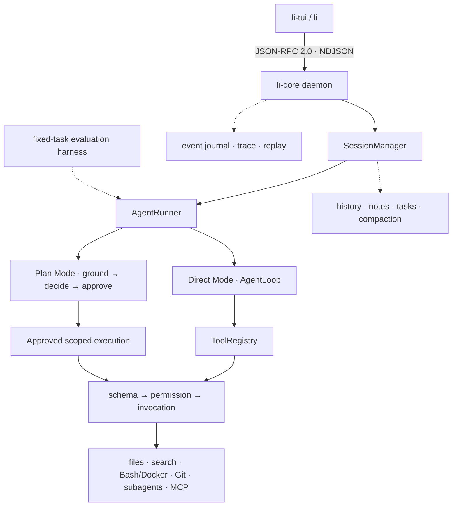

# Li Code

[English](README.md) | [简体中文](README.zh-CN.md)

> A local coding-agent runtime with observable loops, planning, permissions, durable sessions, Git recovery, and reproducible evaluation.

Li Code combines a TUI, CLI, and daemon. It inspects repositories, runs an `AgentLoop`, asks before consequential actions, preserves evidence, and uses a task branch. Plan Mode adds grounded planning and exact approval.

Its evaluation harness separates public tasks from private grading; journals, traces, and replay keep runs inspectable. This engineering-learning project claims neither autonomy nor a hostile-code security boundary.

Public commands are `li`, `li-core`, and `li-tui`. The package `kama_claude`, legacy `kama*` commands, `~/.kama`, and `KAMA_*` variables remain for compatibility.

## Why Li Code

Li Code focuses on the runtime around a model tool call:

- **Visible control flow:** plans, actions, observations, retries, and outcomes become events.
- **Explicit boundaries:** schemas, workspace policy, permissions, and Git mutations are separate layers.
- **Recoverable work:** direct runs use checkpoints on an `agent/<run_id>` branch.
- **Durable evidence:** sessions, notes, summaries, journals, and traces outlive one terminal.
- **Planning receipts:** evidence, immutable decisions, approval, and scope are recorded.
- **Measured behavior:** nine frozen tasks support three post-exit-graded repetitions.

## Architecture

CLI and TUI clients use typed JSON-RPC 2.0 NDJSON to reach `li-core` on TCP loopback.



The daemon owns runtime state: transport, sessions, permissions, MCP, execution, journals, and traces.

## Core Features

| Area | Implemented behavior |
| --- | --- |
| Runtime | Bounded `AgentLoop`, events, conservative retries, cancellation, compaction |
| Interfaces | Textual TUI for interaction; CLI for startup, inspection, and scripts |
| Protocol | Pydantic v2 unions over JSON-RPC 2.0 NDJSON |
| Persistence | History, tasks, notes, summaries, events, and traces |
| Search | Exact search plus optional local similarity retrieval, lexical by default |
| Controls | Workspace policy, permissions, Docker-backed Bash, and Git checkpoints |
| Extensions | Bounded subagents and namespaced MCP tools over stdio or TCP |
| Evaluation | Frozen tasks, repetitions, post-exit hidden grading, metrics, reports |

## Direct Mode and Plan Mode

### Direct Mode

Direct Mode is the default. Reasoning and registered tools alternate until a response or bound. Calls still pass schema validation, permissions, events, and result classification. Today's full interactive path covers inspection, edits, Bash, Git, subagents, MCP, compaction, and traces.

### Plan Mode

Plan Mode separates planning from mutation:

1. Load repository instructions and read-backed architecture evidence.
2. Run a trusted planner, optionally using a read-only explorer.
3. Persist an immutable decision and plan projection.
4. Approve or reject the exact revision and content.
5. Enforce approved capabilities and targets, then record mutation audits and a receipt.

Execution exposes only `read_file`, `list_dir`, `search_code`, and `write_file`. Core implements `plan.execute`, but CLI/TUI only generate, approve, or reject plans. Success is `completed_unverified`; tests/lint are not integrated.

## Sessions and Context

Core manages durable sessions, each with workspace identity, mode, history, notes, tasks, summaries, runs, and a send lock. Sends return a run ID while work continues.

Startup reconciles metadata; an active run from a stopped process becomes interrupted, never silently resumed. Compaction reduces old context but retains artifacts. TUI uses one session and replaces it after daemon identity changes. Same-workspace sessions lack safe mutation isolation.

## Repository Grounding

Before acting, Li Code can combine several repository-local sources:

- repository instructions from `AGENTS.md`, `AGENT.md`, or `CLAUDE.md`;
- global/project context at `~/.kama/context.md` and `.kama/context.md`;
- notes, summaries, exact `search_code`, and optional `search_semantic`;
- Plan Mode read evidence and a snapshot tied to the decision.

Similarity retrieval is deterministic lexical search, not neural embeddings. It incrementally indexes symbol chunks and can fall back to literal search. ONNX is reserved, not implemented.

## Tool Execution and Permission Boundary

Every normal tool call follows the same boundary:

```text
model request
  → registry lookup
  → Pydantic argument validation
  → PermissionManager decision
  → tool invocation
  → normalized result/error
  → journal and trace events
```

Default policy is deliberately asymmetric:

| Operation | Default |
| --- | --- |
| Repository reads and searches | Allow |
| File writes and Bash commands | Ask |
| Read-only Git inspection | Allow |
| Git checkpoints, commits, and rollback | Ask |
| Dynamically registered or unknown tools | Ask unless policy grants them |

Decisions are one-time or persisted in `~/.kama/policy.toml`. Files resolve against a canonical workspace with containment and sensitive-path rules. MCP is outside this policy.

Bash uses Docker by default: the workspace is writable, `.git` is read-only, with timeout/cancellation. Network is enabled by default, so this is containment—not a hostile-code sandbox. Disabling Docker selects host execution.

## Git Safety Workflow

For a direct run with Git enabled, the normal lifecycle is:

```text
clean workspace or approved dirty baseline
  → create/switch to agent/<run_id>
  → record baseline and internal checkpoints
  → perform approved mutations
  → inspect diff
  → explicitly finalize or roll back when requested
```

For a dirty start, Li Code asks and saves a snapshot. Git writes require permission. Finalization can squash checkpoints, rejects unsafe interleaved commits, and secret-scans staged changes. Rollback stays on the task branch.

Failure rollback exists but is off by default. Configured `worktree` mode is not wired into production isolation; task branches are the implemented default.

## Subagents and MCP

Subagents start cold, run foreground/background, return through `agent_result`, and use role profiles. Nesting/spawns are bounded; child events join the parent run and journal.

MCP servers use stdio or TCP. Li Code initializes available servers, discovers tools as `server__tool`, tolerates failed optional servers, and closes connections on shutdown. MCP output is untrusted external content.

## Evaluation Harness

The internal harness targets reproducibility, not a leaderboard.

```text
public task + public workspace
  → isolated agent attempt
  → worker exits
  → private grader and hidden tests are injected
  → capability metrics + trace + report
```

The frozen suite has **9 tasks**: bug fix, feature, and test generation at three difficulty levels. Each runs **3 times** for 27 attempts. Hidden tests and references appear only after worker exit.

It is not SWE-bench, security certification, or a general ability measure. No score is claimed: tracked artifacts lack a publishable observed-result report. See the [contract](benchmarks/README.md) and [manifest](benchmarks/suites/kama-coding-mvp-v1.freeze.json).

## Quick Start

Requirements:

- Python 3.12
- [uv](https://docs.astral.sh/uv/)
- Docker for the default Bash executor
- credentials for a configured LLM provider

```bash
git clone https://github.com/CarbeneLee/Claudecode_lite-main.git li-code
cd li-code
uv sync
cp .env.example .env
```

Configure provider credentials from [`.env.example`](.env.example); never commit the populated `.env`.

Start and inspect the daemon:

```bash
uv run li core start
uv run li core status
uv run li ping
uv run li-tui
```

Launch the primary interface from the repository you want Li Code to inspect:

```bash
cd /path/to/your-project
uv run --project /path/to/li-code li-tui
```

Or submit a scripted request:

```bash
uv run --project /path/to/li-code li run --goal "Explain the request path before proposing a change"
uv run --project /path/to/li-code li run --mode plan --goal "Plan a bounded refactor of the parser"
```

Compatibility commands `kama`, `kama-core`, and `kama-tui` remain available.

## Example Workflow

A practical direct-mode loop looks like this:

1. Start `li-core`; launch `li-tui` in the target repository.
2. Ask for the relevant execution path and proposed change.
3. Review events and approve only necessary writes or commands.
4. Inspect the task-branch diff and run focused verification.
5. Finalize Git only after accepting the evidence; use replay to investigate failures.

For planning, enter `/plan`, submit a goal, then `/approve` or `/reject`. Approval records intent but does not launch execution until a frontend exposes `plan.execute`.

## Engineering Quality

The project keeps runtime contracts and verification in the repository:

```bash
uv run pytest tests/unit -q
uv run pytest tests/integration -q
uv run pytest tests/eval tests/benchmark -q
uv run ruff check src tests scripts
uv run mypy src
uv run python scripts/gen_protocol_doc.py --check
```

Tests cover protocol, transport, sessions, permissions, tools, Git, subagents, MCP, replay, Plan Mode, evaluation, and Docker. CI checks containers and scoped mutation. Counts are omitted because they drift.

## Current Limitations

- Loopback transport assumes a trusted local client; there is no authentication or multi-user authorization layer.
- Multiple core sessions are durable, but concurrent writes to the same workspace are not isolated.
- Plan generation and approval are user-facing; approved execution is currently protocol-only.
- Plan execution records `completed_unverified` and does not automatically run tests or linters.
- The Docker Bash executor is containment, not a hardened hostile-code sandbox; networking is enabled by default.
- MCP tools remain an external trust boundary outside built-in filesystem enforcement.
- “Semantic” search is lexical by default; the reserved ONNX backend is not implemented.
- Git task branches are implemented; configured worktree mode is not yet active production isolation.
- The nine-task evaluation suite is project-specific and cannot support broad capability claims.
- Provider quality, latency, cost, and availability remain external dependencies.

## Origin & Attribution

Li Code began from [youngyangyang04/KamaClaude](https://github.com/youngyangyang04/KamaClaude) and evolved with a dual-process runtime, workspace and permission controls, sessions, subagents/MCP, replay, Docker execution, Git tooling, local retrieval, Plan Mode, and evaluation.

It is maintained as an engineering-learning project under the [MIT License](LICENSE), preserving upstream attribution. “Implemented,” “tested,” “benchmarked,” and “planned” remain separate evidence levels.

## Further Documentation

- [Wire protocol](WIRE_PROTOCOL.md) — generated command and event contract
- [Benchmark contract](benchmarks/README.md) — scope, grading boundary, and interpretation rules
- [Frozen evaluation suite](benchmarks/suites/kama-coding-mvp-v1.freeze.json) — immutable task manifest
- [Repository instructions](AGENTS.md) — architecture, commands, conventions, and safety rules
- [Environment template](.env.example) — provider configuration schema
- [Dockerfile](Dockerfile) and [Compose configuration](compose.yaml) — reproducible deployment assets
- [MIT License](LICENSE) — license and upstream attribution
