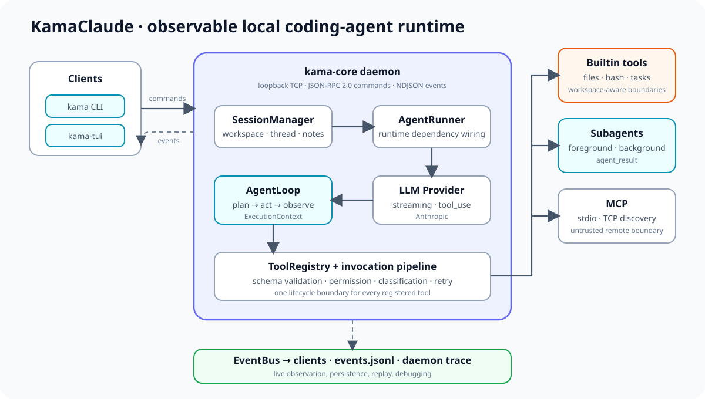
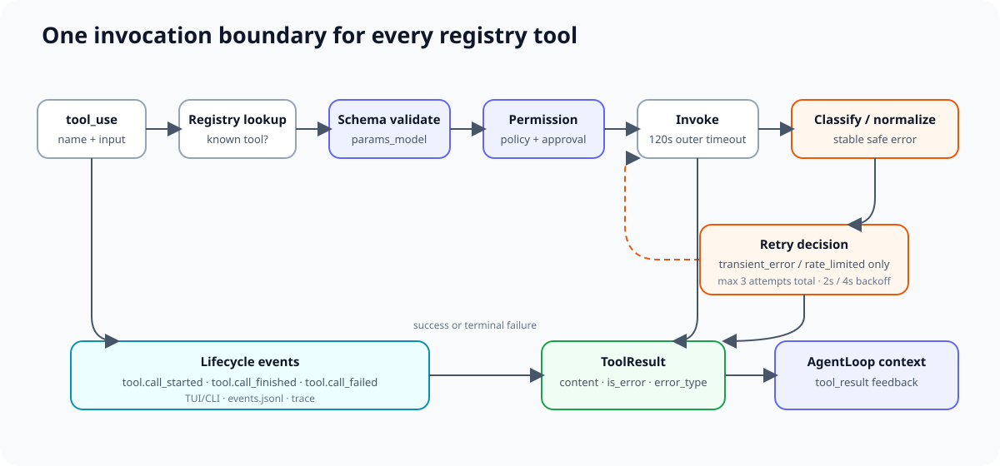
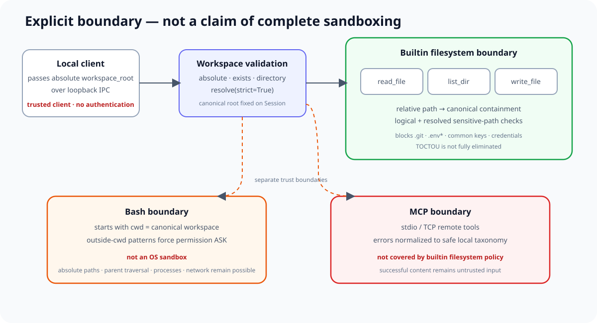
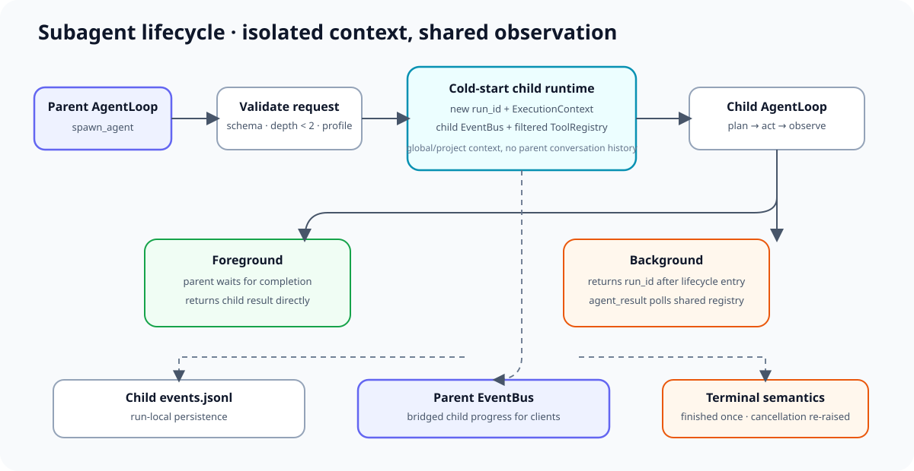

# KamaClaude

> **KamaClaude is a local coding-agent runtime focused on explicit workspace boundaries, safe tool execution, observable agent loops, and extensible Subagent/MCP workflows.**

一个面向本地代码任务的可观测 Coding Agent Runtime，重点实现显式 workspace、安全工具边界、稳定错误语义、会话续航、Subagent 和 MCP 扩展。

`Python 3.12` · `JSON-RPC 2.0 / NDJSON` · `CLI + TUI` · `Workspace-aware tools` · `Trace & replay`



KamaClaude 将交互客户端与常驻 Core daemon 分离：CLI/TUI 负责发起任务和展示事件，daemon 负责 session、AgentLoop、工具调用、权限、持久化和扩展生命周期。它不是 Claude Code 或 Codex 的替代品，也不把 Bash 包装描述成生产级沙箱；这个仓库更关注可读、可验证的 Agent runtime 边界。

## Why this fork

本项目基于上游 [youngyangyang04/KamaClaude](https://github.com/youngyangyang04/KamaClaude)。当前 fork 保留上游的教学型 daemon/CLI/TUI 主线，并围绕以下工程边界做了独立加固：

- **Explicit workspace lifecycle**：workspace 由客户端显式传入，在 Session、Runner、builtin tools 和 Subagent 间持续传播。
- **Filesystem boundary**：`read_file`、`list_dir`、`write_file` 使用 canonical path containment 和敏感路径策略。
- **Stable tool errors**：工具异常收敛为稳定 taxonomy；未知异常只向模型返回安全摘要。
- **Conservative retry**：仅 `transient_error` 与 `rate_limited` 自动重试，永久错误只执行一次。
- **Mutation-tested invocation core**：对 `tools/errors.py` 与 `tools/invocation.py` 做局部 mutation testing，而非用局部分数代表整个项目。
- **Lifecycle cleanup**：Bash 子进程、Subagent 后台任务和 MCP 连接在超时、取消或 daemon 退出路径上执行清理。
- **Subagent and MCP hardening**：明确前台/后台 Subagent 结果语义，并把 MCP 错误视为不可信远端输入。

这些改造不否定上游工作，也不意味着所有代码均由当前 fork 从零原创。上游 attribution 与 MIT 许可见文末。

## Current capabilities

### Agent Runtime

- `AgentRunner` 组装 provider、工具注册表、权限管理器、compactor、事件写入器和运行上下文。
- `AgentLoop` 执行 plan → act → observe 循环，接收结构化 `tool_use`，并把 `ToolResult` 作为 `tool_result` 回填给模型。
- Anthropic provider 支持流式 token、thinking block 回填、prompt caching 标记和有限网络重试。
- `kama-core` 是常驻 daemon；`kama` CLI 与 `kama-tui` 通过 loopback TCP 上的 JSON-RPC 2.0/NDJSON 与之通信。
- CLI 提供 `ping`、`echo`、`run`、`chat`、`core`、`trace`；TUI 是主要交互界面。

### Sessions and Context

- Chat 与 one-shot Session 都绑定创建时的 canonical workspace。
- `thread.jsonl` 保存多轮消息，`notes.md` 保存主动记忆，每个 run 独立保存事件与 task 状态。
- 全局 `~/.kama/context.md`、项目 `.kama/context.md`、Session notes 分层进入 system prompt。
- 支持 tool result 截断、上下文水位事件、自动 compact 配置和手动 `session.compact` 协议。
- `EventBus` 将运行事件分发给 TUI/CLI、`events.jsonl` 和 trace；客户端可按 run 回放已落盘事件。

### Built-in Tools

顶层 Agent 的 registry 根据运行上下文注册以下工具：

| 类别 | 工具 | 说明 |
| --- | --- | --- |
| Filesystem | `read_file` | 读取 workspace-relative 文本，最多返回 512 KiB |
| Filesystem | `list_dir` | 递归目录树，深度最多 4、条目最多 200 |
| Filesystem | `search_code` | 有界 literal 代码搜索，只返回 workspace-relative 路径 |
| Filesystem | `write_file` | 在 workspace 内创建/覆盖文本，输入最多 1 MiB |
| Process | `bash` | 从 workspace cwd 启动非交互 shell，输出最多 64 KiB |
| Tasks | `task_create`, `task_update`, `task_list`, `task_get` | 管理当前 run 的结构化任务 |
| Memory | `note_save` | 仅 Session run 注册，向 `notes.md` 追加持久化笔记 |
| Delegation | `spawn_agent`, `agent_result` | 启动前台/后台 Subagent，并查询后台结果 |
| MCP | `<server>__<tool>` | daemon 启动时发现并包装配置的 MCP tools |

### Workspace and Permissions

- `agent.run` 与 `session.create` 都要求绝对、存在且为目录的 `workspace_root`，Core 将其解析为 canonical path。
- Builtin filesystem tools 只接受 workspace-relative 路径；绝对路径、symlink 逃逸和 canonical containment 失败会被拒绝。
- `.git`、`.env*`（允许 `.env.example`/`.env.template`）、常见私钥与 credential 文件受到敏感路径规则保护。
- `read_file`/`list_dir`/`search_code` 默认允许，`write_file`/`bash` 默认请求审批；`always_allow`/`always_deny` 可持久化到 `~/.kama/policy.toml`。
- Bash 中出现绝对路径、`~`、`..`、`$HOME`、`$PWD` 或 `cd` 等 outside-cwd 特征时会强制进入审批路径。
- `tool.call_started` 保留 schema validation 前的原始参数；事件消费者必须将其视为不可信结构化数据，并在展示边界转义。
- `search_code` 结果是不可信仓库内容，可能包含类似 prompt injection 的文本。
- `search_code` 从 canonical workspace root 逐组件使用 no-follow 文件描述符打开目录/文件，并将大小检查与读取绑定到同一已打开文件，拒绝 policy 检查后的 symlink swap。
- Hardened `search_code` 当前支持具备 `dir_fd`、fd-based `scandir`、`O_NOFOLLOW` 与 `O_DIRECTORY` 的 POSIX/Linux/macOS；Windows secure backend 尚未实现，能力缺失时会 fail closed。Pure Python 不代表已经具备完整跨平台安全后端。
- 显式搜索 root 不可读时返回稳定权限失败，FIFO/socket/device 等特殊 root 在 open 前返回 `invalid_input`；递归 child 不可读则计入 `skipped_unreadable` 并继续搜索。
- 文件读取只把 empty bytes 视为 EOF；short read 会继续读取。恰好填满总 byte budget 的完整文件会保留，只有仍有未读内容或遇到下一个候选时才标记 `byte_limit`。
- `search_code` 的普通 snippet 以 400 个转义后字符为目标；为保留完整 match，最坏可扩展到 514 字符，但最终输出仍严格受 32 KiB UTF-8 byte cap 限制。
- 单目录条目超限会丢弃该目录的整个 batch 并结束搜索，不会搜索前 5,000 个部分候选。
- 1 MiB 是单文件输入 byte cap，不代表峰值内存；whole-file UTF-8 decode、Unicode casefold offset mapping 与输出转义会产生额外的有界内存放大。
- 搜索线程使用协作式 cancellation；Python 无法强制中断一个永久阻塞的 filesystem read，因此 120 秒不是任意文件系统上的绝对 wall-clock 上限。

### Reliability and Error Semantics

- Pydantic 参数校验发生在权限审批与实际调用之前；校验反馈只保留静态 schema 字段路径和错误类型。
- 工具失败统一为稳定 error type，并通过 `tool.call_failed` 事件与 `ToolResult` 返回 AgentLoop。
- 只有 `transient_error`、`rate_limited` 可重试，最多 3 次总尝试，退避间隔为 2s/4s。
- `not_found`、`invalid_input`、`permission_denied`、`command_failed`、`execution_error` 等永久失败只调用一次。
- 未知异常的原始内容只写日志，模型侧只收到 `tool execution failed`；MCP 的远端错误文本也不会直接作为错误详情回填。
- `asyncio.CancelledError` 保持控制流并向上游传播，不会被包装成普通 ToolResult。

### Extensibility

- Skills 支持内建、用户级和 workspace 级三级覆盖，并可限制允许工具列表。
- `spawn_agent` 使用冷启动子上下文，可前台等待或后台返回 `run_id`；最大嵌套深度为 2。
- `agent_result` 返回 `still running`、成功结果或稳定失败类型。
- MCP manager 支持 stdio/TCP transport、`tools/list` discovery、带 server 前缀的名称隔离和 daemon shutdown 清理。

### Quality snapshot

以下数据对应以 `706861b` 为基线的当前未提交 Phase 5 工作树，并来自 2026-07-18 的本地 fresh verification：

| Gate | Result |
| --- | --- |
| Phase 5 search focused | 65 passed |
| Phase 5 wiring | 146 passed |
| Central invocation/loop regression | 104 passed |
| Unit tests | 602 passed |
| Integration tests | 26 passed |
| Ruff | passed |
| mypy strict | 93 source files, no issues |
| Generated wire protocol | up to date |
| Phase 5 manual mutation probes | 11 类已在隔离副本中 killed；不是全仓库 mutation score |
| Earlier scoped mutation run | invocation/errors 两文件：465 generated，446 killed，19 survived，0 timeout；raw score 95.91%（本轮未重跑） |

Earlier mutation score 只覆盖 `src/kama_claude/core/tools/errors.py` 与 `src/kama_claude/core/tools/invocation.py`，**不是整个仓库的 mutation coverage**。Phase 5 的 11 类 manual probes 也只证明相应测试能杀死指定 mutation。

## Architecture

运行时的主要数据流是：

```text
CLI / TUI
  → loopback TCP + JSON-RPC 2.0 / NDJSON
  → kama-core daemon
  → SessionManager / AgentRunner
  → AgentLoop ↔ LLM Provider
  → ToolRegistry
  → validation / permission / invocation / workspace policy
  → builtin tools / Subagent / MCP
  → EventBus → CLI/TUI + events.jsonl + trace
```

关键边界：

- **Protocol boundary**：command/response 使用 JSON-RPC 2.0；push event 使用 NDJSON event envelope。
- **Session boundary**：workspace 在 Session 创建时固定，多轮消息不会切换到 daemon cwd。
- **Invocation boundary**：所有 registry tool 都经过同一参数校验、权限、错误分类、重试与事件管线。
- **Observation boundary**：事件文件按 run 持久化；daemon trace 可记录 IPC、event 和 LLM 层。

## Tool invocation pipeline



每次工具调用先发布 `tool.call_started`，再按 registry lookup、schema validation、permission、invoke 的顺序执行。成功发布 `tool.call_finished`；失败先分类并判断是否属于有限 retry allowlist，最终发布 `tool.call_failed`。无论成功或失败，最终结果都会回到 AgentLoop context，供模型下一步判断。

### Error semantics

| Error type | Meaning | Automatic retry |
| --- | --- | --- |
| `schema_error` | 参数不符合工具的 Pydantic schema | No |
| `not_found` | 请求的 workspace 路径或资源不存在 | No |
| `invalid_input` | 工具理解了请求，但业务输入无效 | No |
| `permission_denied` | 策略或用户拒绝执行 | No |
| `command_failed` | 工具已执行，但命令/远端工具报告失败 | No |
| `execution_error` | 未知或不安全公开细节的执行失败 | No |
| `transient_error` | 工具明确报告临时故障 | Yes, up to 3 attempts total |
| `rate_limited` | 工具明确报告限流 | Yes, up to 3 attempts total |

稳定 taxonomy 还包含 `unknown_tool`、`timeout`、`invalid_path`、`sensitive_path`、`permission_error`、`is_directory`、`not_directory`。

## Security model



### 当前保证

- `read_file`、`list_dir`、`write_file` 对 logical path 与 canonical path 同时应用 workspace containment 和 sensitive-path policy。
- Session、Runner、builtin tools 与 Subagent 使用同一个 canonical workspace root。
- 参数校验失败、权限拒绝和其他永久失败不会被自动重放。
- 未知 Python exception 的内容被净化；validation feedback 不回显用户输入值。
- cancellation 保持异步控制流；Bash 在超时/取消/异常路径尝试 kill 并 reap 子进程。
- `search_code` 将 canonical containment/policy 与逐组件 no-follow fd open 结合，stat/read 绑定同一描述符。
- MCP unavailable/tool error 被映射为稳定、安全的本地错误摘要。

### 当前不保证

- Core 默认监听 loopback，但这是**受信本地客户端模型**，不是多用户认证或授权系统。
- Bash 的 workspace 只是启动 cwd，**不是 OS sandbox**；shell 可以通过绝对路径、父目录、子进程或网络越过 workspace。
- MCP tools 不经过 builtin filesystem resolver/policy；其权限与隔离取决于远端 server 和启动环境。
- 除 `search_code` 读取路径外，其他 filesystem tools 的校验与实际 I/O 间仍可能存在 TOCTOU；写入路径也未实现原子替换。
- MCP 成功内容仍是不可信数据；当前没有统一的成功输出大小、schema 或 prompt-injection 边界。

## Subagent lifecycle



- Parent Agent 调用 `spawn_agent` 后，系统创建独立 `ExecutionContext`、EventBus、registry 与 run directory。
- Child 不继承 parent 对话历史，但会加载全局/project context，并可应用 planner/executor/reviewer profile。
- 前台模式等待 child 完成并直接返回 ToolResult；后台模式返回 `run_id`，parent 用 `agent_result` 轮询。
- Child 事件桥接到 parent EventBus，同时写入 child `events.jsonl`。
- 取消进入 child lifecycle 后会标记失败、尝试发出一次 terminal event，并恢复原始 cancellation 控制流。

## Quick start

### Prerequisites

- Python `>=3.12,<3.13`
- [uv](https://docs.astral.sh/uv/)
- Anthropic API key；当前生产 provider 是 Anthropic，model 由 `KAMA_LLM_DEFAULT_MODEL` 配置

### Install and configure

```bash
git clone https://github.com/CarbeneLee/Claudecode_lite-main.git
cd Claudecode_lite-main
uv sync
cp .env.example .env
```

在本地 `.env` 中设置自己的凭据；不要提交该文件：

```dotenv
ANTHROPIC_API_KEY=your-api-key
KAMA_LLM_DEFAULT_MODEL=claude-sonnet-4-6
```

配置优先级为：内建默认值 → `~/.kama/config.toml` → `.kama/config.toml` → `.env` → 环境变量。若设置 `KAMA_CONFIG`，则只加载指定 TOML，再应用 `.env`/环境变量覆盖。

### Start and inspect the daemon

```bash
uv run kama core start
uv run kama core status
uv run kama ping
```

前台调试 daemon 时也可以使用：

```bash
uv run kama-core
```

### Run a task

在希望作为 workspace 的目录中运行客户端：

```bash
KAMACLAUDE_DIR="$(pwd)"  # 在 KamaClaude 仓库根目录执行这一行
cd /path/to/your/project
uv run --project "$KAMACLAUDE_DIR" kama run --goal "Summarize the repository structure"
```

多轮 CLI chat：

```bash
uv run --project "$KAMACLAUDE_DIR" kama chat
```

主要 TUI：

```bash
uv run --project "$KAMACLAUDE_DIR" kama-tui
```

查看 trace（可按 run、layer、direction 过滤）：

```bash
uv run kama trace
uv run kama trace <run_id> --layer event
uv run kama trace <run_id> --raw
```

停止 daemon：

```bash
uv run kama core stop
```

## Example workflow

下面的示例使用临时 workspace，避免把练习写入私人项目：

```bash
KAMACLAUDE_DIR="$(pwd)"  # 当前目录应为 KamaClaude 仓库根目录
mkdir -p /tmp/kama-demo
cd /tmp/kama-demo
printf '# Demo workspace\n' > README.md

uv run --project "$KAMACLAUDE_DIR" kama chat
```

进入 chat 后，可以依次输入：

```text
List this workspace and read README.md.
Search this workspace for the literal text "workspace".
Create notes.txt containing a one-line summary of this workspace.
```

`read_file`/`list_dir`/`search_code` 默认允许；`write_file` 会显示 permission request。CLI chat 使用 `y`（allow once）、`a`（always allow）、`n`（deny once）或 `d`（always deny）响应。任务结束后另开终端查看 trace：

```bash
uv run --project "$KAMACLAUDE_DIR" kama trace --layer event
```

## Testing

```bash
uv run pytest tests/unit -q
uv run pytest tests/integration -q
uv run ruff check src tests scripts
uv run mypy src
uv run python scripts/gen_protocol_doc.py --check
```

Mutation testing 是 invocation/error 核心的专项 gate，配置与范围位于 `pyproject.toml`：

```bash
uv run mutmut run --max-children 4
uv run mutmut results
```

执行 mutation testing 前应使用全新 `mutants/` workspace；不要把增量结果当作 fresh score，也不要把两文件分数外推为仓库整体覆盖率。

## Project status

| Status | Milestone | Evidence boundary |
| --- | --- | --- |
| Completed | Explicit workspace lifecycle and runtime propagation | Session/Runner/tool/Subagent workspace tests |
| Completed | Filesystem containment and sensitive-path policy | Resolver/policy + unit/integration tests |
| Completed | Stable tool errors and conservative retry | Invocation/error tests + focused mutation testing |
| Completed | Builtin/task producer cleanup | Bash/task error and cancellation tests |
| Completed | Subagent/MCP lifecycle cleanup | Focused error/cancellation tests |
| Completed | Bounded workspace `search_code` | Resource/security/cancellation unit and integration tests |

## Roadmap

### Near term

- Workspace summary
- Trace enrichment

### Reliability

- Background registry TTL/eviction
- Explicit `cancel_subagent`
- EventBus subscriber isolation/outbox
- Subprocess process-group cleanup

### Security

- Allowed workspace roots and client authentication
- 将 `search_code` 的 fd-bound 模式扩展到其他 filesystem tools，并补齐 atomic-write hardening
- OS-level Bash sandbox
- MCP capability policy and sandbox
- MCP idempotency keys
- MCP success-output size/schema/prompt-injection boundary

Roadmap 条目是计划，不代表当前可用能力。

## Repository structure

```text
.
├── src/kama_claude/
│   ├── cli/               # kama command client
│   ├── core/              # daemon, loop, session, tools, permissions, extensions
│   └── tui/               # Textual terminal UI
├── tests/
│   ├── unit/
│   └── integration/
├── scripts/               # protocol generation and maintenance helpers
├── docs/images/readme/    # fork-specific README diagrams
├── WIRE_PROTOCOL.md       # generated typed IPC contract
├── pyproject.toml
└── LICENSE
```

## Attribution and license

KamaClaude 最初由 [程序员Carl / youngyangyang04](https://github.com/youngyangyang04/KamaClaude) 发布。当前仓库的 Git 历史以 `chore: import KamaClaude baseline` 导入上游基线，之后由当前 fork 继续实现 workspace、工具错误语义、mutation hardening、Subagent 与 MCP lifecycle 等改造。

项目继续遵循 [MIT License](LICENSE)。版权声明与许可条件以仓库中的 `LICENSE` 为准；分发本软件或其 substantial portions 时应保留原版权与许可声明。
