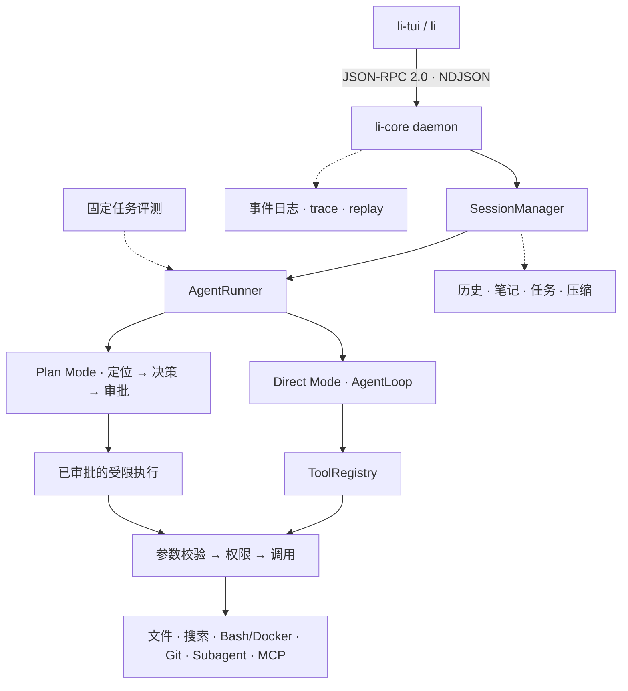

# Li Code

[English](README.md) | [简体中文](README.zh-CN.md)

> 一个本地 Coding Agent Runtime：具备可观察的 Agent 循环、显式规划、权限感知工具、持久会话、Git 恢复点与可复现评测。

Li Code 由 TUI、CLI 和常驻守护进程组成。它能理解代码仓库、运行 `AgentLoop`、在高影响操作前请求许可、保留运行证据，并在任务分支工作。Plan Mode 在受限执行前增加仓库事实定位与精确审批。

固定任务评测将公开任务与私有评分分离，journal、trace 和 replay 则让运行过程可检查。Li Code 是工程学习项目，不代表自主软件开发能力，也不是面向恶意代码的安全边界。

公开命令为 `li`、`li-core`、`li-tui`。为保持兼容，Python 包 `kama_claude`、旧 `kama*` 命令、`~/.kama` 路径与 `KAMA_*` 环境变量仍会出现。

## 为什么选择 Li Code

Li Code 关注“模型调用工具”周围的完整运行时：

- **过程可见：**规划、动作、观察、重试与终态都会成为事件。
- **边界清楚：**参数模型、工作区策略、权限和 Git 变更分层处理。
- **工作可恢复：**Direct Mode 在 `agent/<run_id>` 分支上建立检查点。
- **证据可持久化：**会话、笔记、摘要、事件日志与 trace 不依赖单个终端。
- **规划有回执：**事实证据、不可变决策、审批与执行范围都被记录。
- **行为可衡量：**冻结的 9 项任务可重复 3 次，并在 Agent 退出后评分。

## 架构

CLI 与 TUI 是客户端；常驻 `li-core` 通过 TCP loopback 提供服务，双方使用带类型的 JSON-RPC 2.0 NDJSON 通信。



守护进程拥有传输、会话、权限、MCP、Agent 执行、journal 与 trace，使运行状态不依赖前端。

## 核心能力

| 领域 | 已实现行为 |
| --- | --- |
| 运行时 | 有步数上限的 `AgentLoop`、类型化事件、保守重试、取消和上下文压缩 |
| 界面 | Textual TUI 负责交互；CLI 负责启动、检查、脚本运行与工具命令 |
| 协议 | 基于 Pydantic v2 命令/事件联合类型的 JSON-RPC 2.0 NDJSON |
| 持久化 | 历史、任务、笔记、摘要、run 事件与守护进程 trace |
| 搜索 | 精确搜索及可选的本地相似度检索；默认使用词法向量 |
| 控制 | 工作区策略、权限、Docker Bash 与 Git 检查点 |
| 扩展 | 有界 Subagent；通过 stdio 或 TCP 接入带命名空间的 MCP 工具 |
| 评测 | 冻结任务、重复尝试、退出后隐藏评分、指标与报告 |

## Direct Mode 与 Plan Mode

### Direct Mode

Direct Mode 是默认模式。模型在推理与已注册工具之间循环，直到得到终态回复或触及配置上限。每个调用仍要经过参数校验、权限、事件与结果分类。当前完整交互路径涵盖阅读、修改、Bash、Git、Subagent、MCP、上下文压缩和 trace。

### Plan Mode

Plan Mode 将规划与修改分开：

1. 加载仓库指令并收集有读取依据的架构证据。
2. 运行可信 planner，必要时调用只读 explorer。
3. 持久化不可变决策与计划投影。
4. 对准确的版本和内容执行批准或拒绝。
5. 约束已批准的能力与目标，并记录修改审计和执行回执。

受批执行目前只开放 `read_file`、`list_dir`、`search_code`、`write_file`。Core 已实现 `plan.execute`，但当前 CLI/TUI 尚未暴露执行入口，只能生成、批准或拒绝计划。成功执行的状态是 `completed_unverified`，因为该路径尚未集成测试或 lint 验证。

## 会话与上下文

Core 可管理多个持久会话。每个会话拥有工作区身份、模式、历史、笔记、任务、摘要、run 记录及防止会话内重叠发送的锁。发送消息会立即返回 run ID，任务在后台继续。

启动时会协调已有元数据；进程停止时仍活跃的 run 会标记为 interrupted，不会静默续跑。自动或手动压缩可减少旧上下文并保留持久证据。TUI 一次连接一个会话，发现守护进程身份变化后会新建会话。多个会话同时修改同一工作区尚无安全隔离。

## 仓库事实定位

行动前，Li Code 可组合：

- 来自 `AGENTS.md`、`AGENT.md` 或 `CLAUDE.md` 的仓库指令；
- `~/.kama/context.md` 与 `.kama/context.md` 全局/项目上下文；
- 笔记、摘要、精确 `search_code` 及可选 `search_semantic`；
- 与 Plan 决策绑定的读取证据和仓库快照。

默认相似度检索是确定性的词法检索，而非神经网络 embedding。它增量索引以符号为中心的代码块，并可降级到精确搜索；预留的 ONNX 后端尚未实现。

## 工具执行与权限边界

普通工具调用统一经过：

```text
模型请求
  → 注册表查找
  → Pydantic 参数校验
  → PermissionManager 决策
  → 工具调用
  → 标准化结果/错误
  → journal 与 trace 事件
```

默认策略有意区分风险：

| 操作 | 默认行为 |
| --- | --- |
| 仓库读取与搜索 | 允许 |
| 文件写入与 Bash | 询问 |
| 只读 Git 检查 | 允许 |
| Git 检查点、提交与回滚 | 询问 |
| 动态注册或未知工具 | 除非策略允许，否则询问 |

权限可单次生效，也可持久化到 `~/.kama/policy.toml`。文件工具相对规范化工作区解析路径，并执行范围和敏感路径规则。MCP 是独立信任边界，不自动受内置文件策略保护。

Bash 默认使用 Docker：工作区可写、`.git` 只读，并有超时/取消控制。网络默认开放，因此它提供的是实用隔离，而非恶意代码沙箱。关闭 Docker 后会使用宿主机执行。

## Git 安全工作流

启用 Git 的 Direct Mode 通常经历：

```text
干净工作区或获批的脏基线
  → 创建/切换 agent/<run_id>
  → 记录基线与内部检查点
  → 执行获批修改
  → 检查 diff
  → 按请求显式完成或回滚
```

脏工作区开始前必须询问，并为该 run 保存快照。Git 写操作仍受权限控制。完成操作可压缩内部检查点，会拒绝不安全的交错外部提交，并扫描暂存差异中的疑似密钥。回滚仅限 Agent 任务分支。

失败自动回滚默认关闭。配置中的 `worktree` 模式尚未接入生产隔离；当前实现使用任务分支。

## Subagent 与 MCP

Subagent 以冷上下文启动，可前台或后台运行，经 `agent_result` 返回，并支持 explorer、planner、executor、reviewer 角色。嵌套层级和生成数量有界；子事件进入父 run 与持久 journal。

MCP 支持 stdio 或 TCP。Li Code 初始化可用服务，将发现的工具注册为 `server__tool`；可选服务失败不阻塞 Core，关闭时释放连接。MCP 输出按不可信外部内容处理。

## 评测体系

内置 Coding Task Harness 用于可复现评测，而非排行榜宣传。

```text
公开任务 + 公开工作区
  → 隔离的 Agent 尝试
  → worker 退出
  → 注入私有 grader 与隐藏测试
  → 能力指标 + trace + 报告
```

冻结套件含 **9 个任务**：bugfix、feature、test generation 各覆盖 easy、medium、challenging。每项运行 **3 次**，共 27 次尝试。隐藏测试与参考材料只在 worker 退出后出现。

它不是 SWE-bench、安全认证或通用编程能力指标。当前受版本控制的产物不含可公开的观测结果报告，因此这里不声明公开分数。详见[评测契约](benchmarks/README.md)与[冻结清单](benchmarks/suites/kama-coding-mvp-v1.freeze.json)。

## 快速开始

要求：

- Python 3.12
- [uv](https://docs.astral.sh/uv/)
- 默认 Bash 执行器需要 Docker
- 已配置的 LLM Provider 凭据

```bash
git clone https://github.com/CarbeneLee/Claudecode_lite-main.git li-code
cd li-code
uv sync
cp .env.example .env
```

根据 [`.env.example`](.env.example) 配置 Provider 凭据，切勿提交填好的 `.env`。

启动并检查守护进程：

```bash
uv run li core start
uv run li core status
uv run li ping
uv run li-tui
```

在待处理仓库中启动主要界面：

```bash
cd /path/to/your-project
uv run --project /path/to/li-code li-tui
```

也可提交脚本请求：

```bash
uv run --project /path/to/li-code li run --goal "Explain the request path before proposing a change"
uv run --project /path/to/li-code li run --mode plan --goal "Plan a bounded refactor of the parser"
```

兼容命令 `kama`、`kama-core`、`kama-tui` 仍然可用。

## 示例工作流

一次实用的 Direct Mode 流程：

1. 启动 `li-core`，在目标仓库运行 `li-tui`。
2. 要求定位相关执行路径并解释拟议变更。
3. 检查事件，只批准必要的写入或命令。
4. 查看任务分支 diff，并执行最小相关验证。
5. 接受证据后再完成 Git；失败时用 replay 调查。

规划时在 TUI 输入 `/plan`，提交目标，再使用 `/approve` 或 `/reject`。审批只记录意图；前端暴露 `plan.execute` 前不会启动执行。

## 工程质量

仓库内保留运行契约和验证入口：

```bash
uv run pytest tests/unit -q
uv run pytest tests/integration -q
uv run pytest tests/eval tests/benchmark -q
uv run ruff check src tests scripts
uv run mypy src
uv run python scripts/gen_protocol_doc.py --check
```

测试覆盖协议、传输、会话、权限、工具、Git、Subagent、MCP、replay、Plan Mode、评测和 Docker。CI 还检查容器构建与定向 mutation test。测试数量会变化，因此不写死计数。

## 当前限制

- Loopback 传输假设本机客户端可信，无认证或多用户授权层。
- Core 会话可持久化，但同一工作区的并发写入没有隔离。
- Plan 生成与审批已有界面，获批执行目前仅能通过协议调用。
- Plan 执行记录 `completed_unverified`，不会自动运行测试或 lint。
- Docker Bash 是实用隔离而非恶意代码沙箱，且默认开放网络。
- MCP 位于内置文件系统强制策略之外，是外部信任边界。
- “语义”搜索默认是词法检索，ONNX 后端尚未实现。
- Git 任务分支已实现，worktree 模式尚未成为生产隔离。
- 9 项评测仅适用于本项目，不能支持宽泛能力结论。
- Provider 的质量、延迟、成本与可用性仍是外部依赖。

## 起源与致谢

Li Code 起源于 [youngyangyang04/KamaClaude](https://github.com/youngyangyang04/KamaClaude)，此后扩展了双进程运行时、工作区与权限控制、持久会话、Subagent/MCP、replay、Docker 执行、Git 工具、本地检索、Plan Mode 和评测体系。

项目以工程学习为目的维护，依据 [MIT License](LICENSE) 开源并保留上游署名。“已实现”“已测试”“已评测”“规划中”始终是不同证据等级。

## 延伸文档

- [通信协议](WIRE_PROTOCOL.md) — 生成的命令与事件契约
- [评测契约](benchmarks/README.md) — 范围、评分边界与解释规则
- [冻结评测套件](benchmarks/suites/kama-coding-mvp-v1.freeze.json) — 不可变任务清单
- [仓库指令](AGENTS.md) — 架构、命令、规范与安全规则
- [环境变量模板](.env.example) — Provider 配置格式
- [Dockerfile](Dockerfile) 与 [Compose 配置](compose.yaml) — 可复现部署资源
- [MIT License](LICENSE) — 许可证与上游署名
