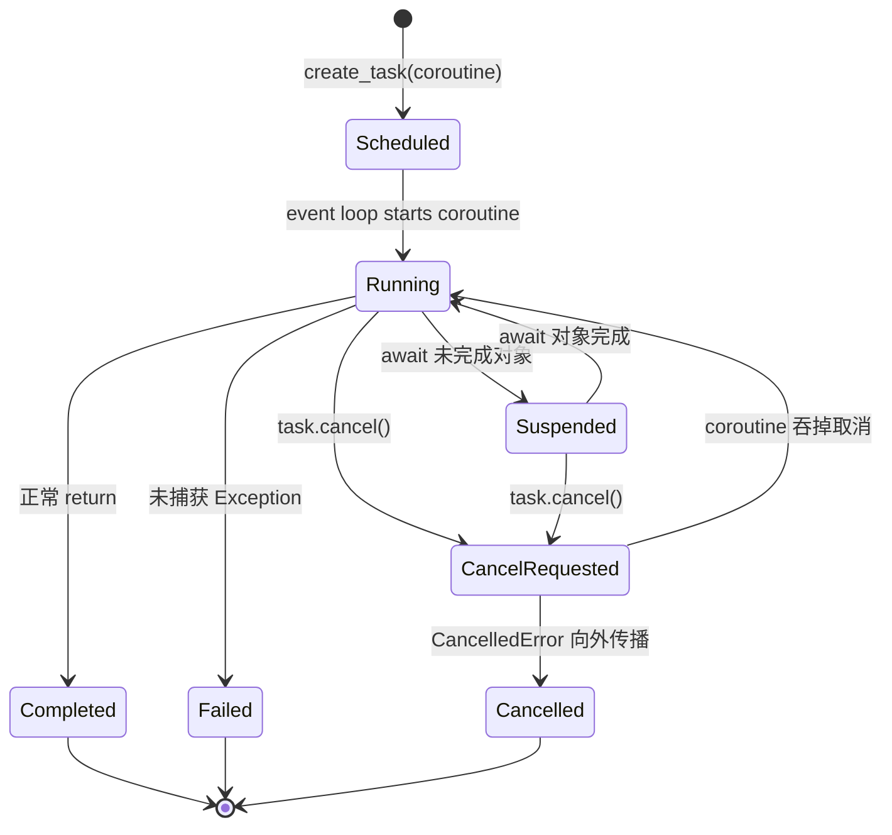

# Devlog 0716：异步任务、Subagent 生命周期与 MCP 错误边界

本文以 KamaClaude Phase 4B.2 的真实代码路径为主线，梳理以下七个主题：

1. `asyncio.Task` 状态机；
2. foreground 与 background 控制流；
3. cancellation propagation；
4. 异常对象与错误结果的区别；
5. 事件生命周期配对；
6. 远程工具的副作用与幂等性；
7. MCP 协议边界与不可信错误信息。

这几个主题表面上分别属于异步编程、错误处理和远程协议，实际上都在回答同一个问题：**一次执行已经走到哪里，外部世界可能发生了什么，以及调用者应该看到哪一种稳定语义？**

---

## 1. `asyncio.Task` 状态机

### 1.1 Coroutine 与 Task 不是同一个概念

调用异步函数只会创建 coroutine 对象：

```python
coroutine = run_child(context)
```

它此时还没有被事件循环调度。以下两种方式才会真正推进 coroutine：

```python
result = await coroutine
task = asyncio.create_task(coroutine)
```

- `await coroutine`：当前协程负责等待它，形成 foreground 控制流。
- `create_task(coroutine)`：把它注册给事件循环独立调度，当前协程可以先返回，形成 background 控制流。

`Task` 因此可以理解为：**coroutine 加上可观察的调度与终态容器**。

### 1.2 概念状态机



Python 公共 API 并不会直接暴露上图所有内部细分状态。调用者主要使用：

| 查询 | 含义 |
| --- | --- |
| `task.done() is False` | task 尚无终态，可能正在运行，也可能挂在某个 await 上 |
| `task.done() is True` | task 已正常完成、异常失败或被取消 |
| `task.cancelled() is True` | coroutine 最终让 `CancelledError` 传播到了 Task 边界 |
| `task.exception()` 返回异常 | task 因未捕获异常结束 |
| `task.exception()` 返回 `None` | task 正常完成 |
| `task.result()` | 正常时返回值；异常/取消时重新抛出对应异常 |

必须先检查 `task.cancelled()`，再调用 `task.exception()`。对 cancelled task 直接调用 `task.exception()` 会再次抛出 `CancelledError`。

### 1.3 `cancel()` 只是请求，不是立即销毁

```python
task.cancel()
```

这一步通常只是安排事件循环在 coroutine 的下一个可取消 await 点抛入 `CancelledError`。因此：

```text
cancel() called
  ≠ coroutine 已停止
  ≠ finally 已执行
  ≠ 文件/进程/连接已清理
  ≠ task.cancelled() 已经为 True
```

正确观察最终状态需要继续 await：

```python
task.cancel()
try:
    await task
except asyncio.CancelledError:
    pass

assert task.cancelled()
```

这也是本轮 background cancellation 测试先用 `asyncio.Event` 确认 task 已进入运行态，再调用 `cancel()`，最后 await task 的原因。

---

## 2. Foreground 与 background 控制流

### 2.1 Foreground：调用栈保持连接

KamaClaude 的 foreground Subagent 由 `SpawnAgentTool.invoke()` 直接 await child lifecycle：

```text
parent AgentLoop
  → invoke_tool(spawn_agent)
    → SpawnAgentTool.invoke
      → publish SubagentStartedEvent
      → await child lifecycle
        → await AgentLoop.run(child_context)
        → publish SubagentFinishedEvent
      → return child ToolResult
```

特征：

- parent 必须等待 child 终止；
- child 的正常结果可以直接转换为 `spawn_agent` 的 ToolResult；
- child 抛出的未知异常可以沿当前调用栈传播给中央 classifier；
- parent 的 cancellation 会自然进入当前 await 链。

foreground 很像普通函数调用，只是每层都是可暂停的 async frame。

### 2.2 Background：调用栈断开，Task 成为结果载体

background 路径使用：

```python
task = asyncio.create_task(run_child(...))
registry.register(run_id, task, context)
return ToolResult(content=f"run_id={run_id}")
```

控制流变成：

```text
spawn_agent caller                 background task
       │                                  │
       ├─ create_task --------------------► child lifecycle
       ├─ register(task, context)          │
       └─ immediately return run_id        ├─ running / suspended
                                          └─ terminal state

later:
agent_result(run_id)
  → registry.get(run_id)
  → inspect task state
  → read context result/status
  → return stable ToolResult
```

此时原始调用栈已经返回，background 的未知异常不可能自动“抛回过去的调用者”。异常被保存在 Task 中，之后由 `agent_result` 查询并翻译成稳定结果。

### 2.3 为什么 registry 同时保存 Task 与 ExecutionContext

两者回答不同问题：

| 对象 | 回答的问题 |
| --- | --- |
| `asyncio.Task` | coroutine 是否仍运行、是否取消、是否抛出 Python 异常？ |
| `ExecutionContext` | delegated execution 的业务状态、reason、result 是什么？ |

典型组合：

| Task 终态 | Context 状态 | 业务解释 |
| --- | --- | --- |
| 正常完成 | success | background success |
| 正常完成 | failed | child 正常得出“任务未完成”，不是 Python 异常 |
| cancelled | failed/cancelled | background cancellation |
| exception | failed/subagent_error | infrastructure/programming unknown failure |

本轮修复前，`agent_result` 只检查 Task 是否异常，却忽略了“Task 正常完成、Context failed”这一组合，因此把 background normal failure 误报为成功。

---

## 3. Cancellation propagation

### 3.1 Cancellation 是控制流，不是普通业务失败

`asyncio.CancelledError` 表示上层不再需要当前执行。它要求协程：

1. 完成自己拥有资源的必要清理；
2. 更新必须落地的生命周期状态；
3. 原样重新抛出取消。

不应把 cancellation 随意转换成普通 ToolResult：

```python
# 错误：上层会误以为调用正常返回
except asyncio.CancelledError:
    return ToolResult(is_error=True, error_type="execution_error")
```

本轮 Subagent 生命周期采用的结构是：

```python
failure: BaseException | None = None
try:
    await child_loop.run(context)
except asyncio.CancelledError as exc:
    context.mark_failed("cancelled")
    failure = exc
except Exception as exc:
    context.mark_failed("subagent_error")
    failure = exc

await publish_finished(context)
if failure is not None:
    raise failure
```

这里暂时保存异常对象，是为了先完成 started/finished 配对，再恢复同一个异常对象的控制流语义。

### 3.2 三层 cancellation 语义

```text
AgentLoop
  catch CancelledError
  → context.mark_failed("cancelled")
  → re-raise

SpawnAgentTool child lifecycle
  catch same CancelledError
  → ensure context failed/cancelled
  → publish SubagentFinishedEvent(status="failed")
  → re-raise same object

invoke_tool
  catch CancelledError
  → re-raise
  → do not create ToolResult
  → do not publish ToolCallFailedEvent
```

因此 cancellation 下会出现一个看似特殊但正确的事件组合：

- `tool.call_started`：已经开始调用 `spawn_agent`；
- `subagent.started`：child 确实已经启动；
- `subagent.finished(status="failed")`：child 生命周期已闭合；
- 没有 `tool.call_failed`：工具调用不是普通错误结果，而是控制流被取消。

### 3.3 不要用 `except BaseException` 兜底

`BaseException` 还包含 `KeyboardInterrupt`、`SystemExit` 等进程级控制信号。生产代码应显式区分：

```python
except asyncio.CancelledError:
    ...
except Exception:
    ...
```

这样既覆盖普通异常，又不会无意吞掉更高层级的终止信号。

---

## 4. 异常对象与错误结果的区别

### 4.1 Exception 是 Python 控制流对象

异常对象包含：

- 具体 Python 类型；
- 对象身份；
- traceback；
- 原始 message；
- cause/context 异常链。

它适合表达：当前函数无法在自己的 domain 边界内稳定解释失败，需要把控制权交给上层。

```python
error = RuntimeError("secret diagnostic")
raise error
```

本轮测试使用：

```python
with pytest.raises(RuntimeError) as exc_info:
    await tool.invoke(...)

assert exc_info.value is error
```

使用 `is` 而不是只比较类型/message，是为了证明 producer 没有创建替代异常、没有错误包装，也没有丢失原对象。

### 4.2 ToolResult 是应用层数据

`ToolResult` 表示工具调用已经在正常 async 控制流中返回，只是业务结局可能失败：

```python
ToolResult(
    content="MCP tool reported an error.",
    is_error=True,
    error_type="command_failed",
)
```

它适合表达调用方能够稳定分类的已知 domain 结局，例如：

- nesting limit → `invalid_input`；
- unknown run_id → `not_found`；
- child 正常 failed → `command_failed`；
- MCP 明确返回 tool error → `command_failed`。

### 4.3 判断准则

| 问题 | 选择 |
| --- | --- |
| producer 是否认识这个失败类型并能给出稳定、安全语义？ | 返回错误 ToolResult |
| 这是取消/终止控制信号吗？ | 清理后重新抛出 |
| 这是未知编程错误或基础设施异常吗？ | 原异常抛给中央 classifier |
| background 调用栈已经断开了吗？ | 让 Task 保存异常，查询时返回安全 `execution_error` |

### 4.4 为什么未知异常不能在 producer 里 `str(exc)`

异常文本可能包含：

- 本地绝对路径；
- token、API key；
- 远端 payload；
- 数据库约束和内部表名；
- server 实现细节。

因此 generic exception 的正确路径是：

```text
producer re-raises original exception
  → central classifier logs traceback
  → caller receives execution_error + fixed safe summary
```

诊断信息仍存在于受控 daemon log，但不会进入 LLM 可见的 ToolResult 或可回放的 failed event。

---

## 5. 事件生命周期配对

### 5.1 Tool lifecycle 与 Subagent lifecycle 是两套状态机

它们相关但不能混为一谈：

```text
tool.call_started(spawn_agent)
  └─ subagent.started(child)
       └─ child execution
          └─ subagent.finished(child)
  └─ tool.call_finished 或 tool.call_failed
```

`ToolCall*Event` 描述父 Agent 的一次工具调用；`Subagent*Event` 描述 child run 自身。

### 5.2 Subagent 配对不变量

一旦 `SubagentStartedEvent` 已发布：

| child 结局 | Finished 数量 | status |
| --- | ---: | --- |
| normal success | 1 | success |
| normal failed context | 1 | failed |
| cancellation | 1 | failed |
| unknown exception | 1 | failed |

此外：

- started 之前失败，不伪造 finished；
- 每个 child 最多一个 finished；
- 多次查询 `agent_result` 不重复发布 finished；
- foreground/background 使用同一个 lifecycle helper，避免两条路径逐渐漂移。

### 5.3 为什么 finished 要在异常重新抛出前发布

如果先 `raise`：

```python
except Exception:
    raise
await publish_finished()  # 永远不可达
```

TUI、trace 和 replay 会永久看到一个 started、没有终态的 child。用户无法区分“仍在运行”与“已经异常消失”。

正确顺序是：

```text
mark context terminal
→ publish finished
→ re-raise original exception/cancellation
```

事件不是装饰性日志，而是外部观察者重建状态机的事实来源。

### 5.4 多次查询为什么不能重新发布 finished

finished 属于执行过程，不属于读取过程。`agent_result` 是纯查询：

```text
execution owns state transition and finished event
query only observes stable terminal state
```

如果每次查询都发布 finished，事件流会把一个 child 伪装成完成多次，破坏计数、UI 和 replay。

---

## 6. 远程工具的副作用与幂等性

### 6.1 “没有收到响应”不等于“远端没有执行”

假设 MCP 工具执行扣款：

```text
client sends request
  → server receives request
  → server performs charge
  → connection drops before response reaches client
```

客户端只观察到 unavailable/EOF/timeout，却无法判断请求停在哪一步：

```text
A. 请求发送前连接失败
B. 请求只发送了一部分
C. server 收到但尚未执行
D. server 已执行，响应丢失
E. server 已执行并发送响应，客户端读取失败
```

自动重试在 A 可能安全，在 D/E 会重复副作用。由于客户端无法证明自己处于 A，所以 unavailable 必须保守地视为 non-retryable `execution_error`。

### 6.2 幂等性是什么

幂等操作满足：重复执行与执行一次的最终效果相同。

典型天然幂等操作：

```text
set user.name = "Alice"
delete resource 123（若重复删除定义为同一终态）
```

典型非幂等操作：

```text
balance -= 100
append message
send email
create order with generated ID
```

“读操作”通常更接近幂等，但也不能仅凭工具名判断：远端 read 可能更新访问计数、刷新缓存或触发审计副作用。

### 6.3 Idempotency key 如何改变重试边界

安全重放通常需要调用方生成稳定 key：

```json
{
  "idempotency_key": "parent-run/tool-use-id",
  "operation": "charge",
  "amount": 100
}
```

server 必须原子地记录 key 和执行结果：

```text
first request with key K
  → execute once
  → store result for K

duplicate request with key K
  → do not execute again
  → return stored result
```

只有客户端传 key 不够；server 也必须承诺去重语义。当前 KamaClaude MCP 调用没有 idempotency key，因此不能把 unavailable 映射为 `transient_error` 或 `rate_limited` 来触发自动重放。

---

## 7. MCP 协议边界与不可信错误信息

### 7.1 MCP wrapper 的位置

KamaClaude 的边界可以概括为：

```text
LLM tool call
  → invoke_tool
    → McpTool.invoke
      → McpClient.call_tool
        → JSON-RPC tools/call
          → external MCP server
```

`McpClient` 负责传输与 JSON-RPC；`McpTool` 负责把远端结果翻译成 KamaClaude 的稳定 ToolResult taxonomy。

### 7.2 远端 error message/code 为什么不可信

远端 server 控制 JSON-RPC error 的：

- `message`；
- `code`；
- 任意附加 data；
- tool 返回的文本内容。

这些字段可能：

- 包含 secret 或内部路径；
- 具有诱导 LLM 的 prompt injection 文本；
- 使用不稳定的 vendor code；
- 错误地把临时失败描述为永久失败，反之亦然；
- 暴露 server stack trace；
- 长度巨大，污染上下文和事件日志。

协议层能证明“远端返回了 error”，但不能证明错误文本适合直接交给 LLM。

### 7.3 Phase 4B.2 的稳定映射

| 来源 | direct producer 行为 | 中央可见结果 | 自动重试 |
| --- | --- | --- | --- |
| success | 正常 ToolResult | success | 不适用 |
| `McpToolError` | 固定安全 `command_failed` | `command_failed` | 否 |
| `McpServerUnavailableError` | 固定安全 `execution_error` | 安全 `execution_error` | 否 |
| unknown `Exception` | 原异常上抛 | classifier → `execution_error` | 否 |
| `CancelledError` | 原对象上抛 | 继续传播 | 不适用 |

MCP wrapper 不再拼接：

```python
str(exc)
server_name + raw error
tool_name + raw error
```

已知 domain failure 返回固定文本；未知异常只在中央受控日志保留 traceback。

### 7.4 `params_model = None` 的边界含义

MCP tool 的 `input_schema` 来自远端 `tool_def`，而本地 wrapper 保持：

```python
params_model = None
```

这表示中央 invocation 不会通过 Pydantic model 做本地参数校验。`input_schema` 会提供给 LLM 生成参数，但它目前不是本地强制执行器。

因此需要清楚区分：

```text
schema as guidance/metadata
  ≠ schema has been locally validated
```

本阶段明确不实现 MCP argument JSON Schema validator；这仍是后续可能的边界增强点。

---

## 8. 用测试证明这些语义

### 8.1 为什么 background 测试使用 `asyncio.Event`

固定 `sleep(0.05)` 只是在猜调度器是否已经走到目标状态。稳定测试改为：

```python
entered = asyncio.Event()
release = asyncio.Event()

async def controlled_run(context):
    entered.set()
    await release.wait()
    context.mark_success()

spawn_background()
await entered.wait()       # 已证明 task 正在目标 await 点
assert agent_result() == "still running"
release.set()
await task                 # 已证明 task 到达终态
assert agent_result() == final_result
```

这不是“让测试多等一会儿”，而是在两个协程之间建立明确的 happens-before 关系。

### 8.2 cancellation 测试的核心断言

```text
task 从 running 进入 cancelled
context.status == failed
context.reason == cancelled
finished failed exactly once
agent_result == command_failed fixed message
invoke_tool failed attempt == 1
```

foreground cancellation 还要断言：

```text
重新抛出的是同一个 CancelledError 对象
没有 ToolResult
没有 ToolCallFailedEvent
```

### 8.3 secret leak 测试的双重边界

测试不能只检查 ToolResult，还要同时检查：

```python
assert secret not in result.content
assert all(secret not in event.error_message for event in failed_events)
```

因为 failed event 会进入 trace/replay/TUI，仅净化返回值仍可能从事件侧泄漏。

---

## 9. 一页总结

```text
asyncio.Task
  = coroutine 的调度和终态容器

foreground
  = 调用栈保持连接，结果/异常直接返回或传播

background
  = 调用栈断开，Task 保存技术终态，Context 保存业务终态

cancellation
  = 控制流；清理和生命周期配对后必须继续传播

Exception
  = Python 控制流 + traceback + 对象身份

ToolResult(is_error=True)
  = 已知、稳定、可序列化的应用层失败数据

events
  = 外部观察者重建状态机的事实，started 后必须有唯一 finished

remote unavailable
  = 结果未知，不代表未执行；无幂等保证时禁止自动重放

MCP error text
  = 远端不可信输入；不得直接进入 LLM、ToolResult 或 failed event
```

---

## 10. 理解检查题

1. 为什么 `task.cancel()` 返回后不能立即断言 `task.cancelled()`？
2. background task 正常完成但 `context.status == "failed"` 应映射为什么？
3. 为什么 foreground unknown exception 能直接抛给中央 classifier，而 background 不行？
4. 为什么 cancellation 可以有 `SubagentFinishedEvent`，却没有 `ToolCallFailedEvent`？
5. `raise original_exception` 与返回 `ToolResult(is_error=True)` 对调用者分别意味着什么？
6. 为什么多次调用 `agent_result` 不能重复发布 `SubagentFinishedEvent`？
7. MCP read timeout 为什么不能自动假设为“请求未执行”？
8. idempotency key 需要 client 和 server 分别提供什么保证？

## 11. 面试追问题

1. 如果 finished event 的 subscriber 自身抛异常，如何同时保持原 cancellation 和事件交付语义？
2. registry 长期不淘汰完成 task 会产生什么内存与隐私风险？
3. 如果需要显式 `cancel_subagent(run_id)`，如何处理 cancel 与正常完成的竞态？
4. 如何为 MCP 增加 idempotency key，同时兼容不支持该能力的第三方 server？
5. 除固定错误摘要外，还可以怎样限制远端 tool success 内容中的 prompt injection 和超大响应？

